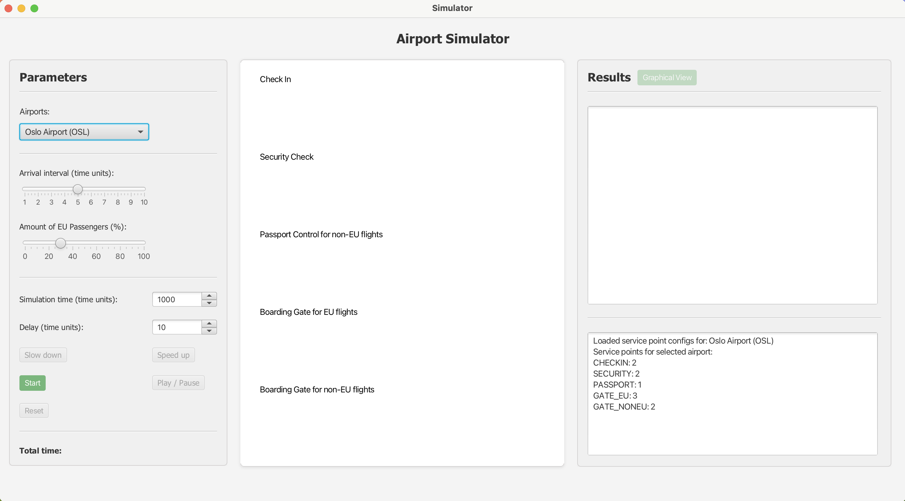
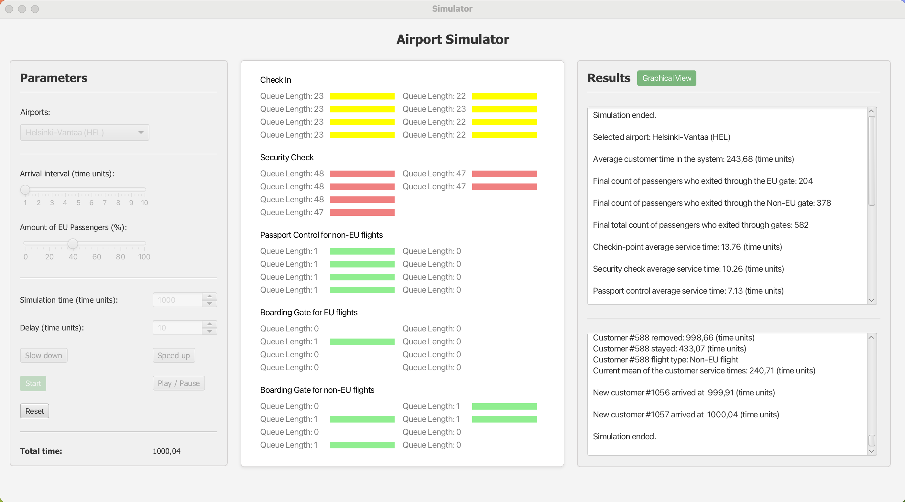
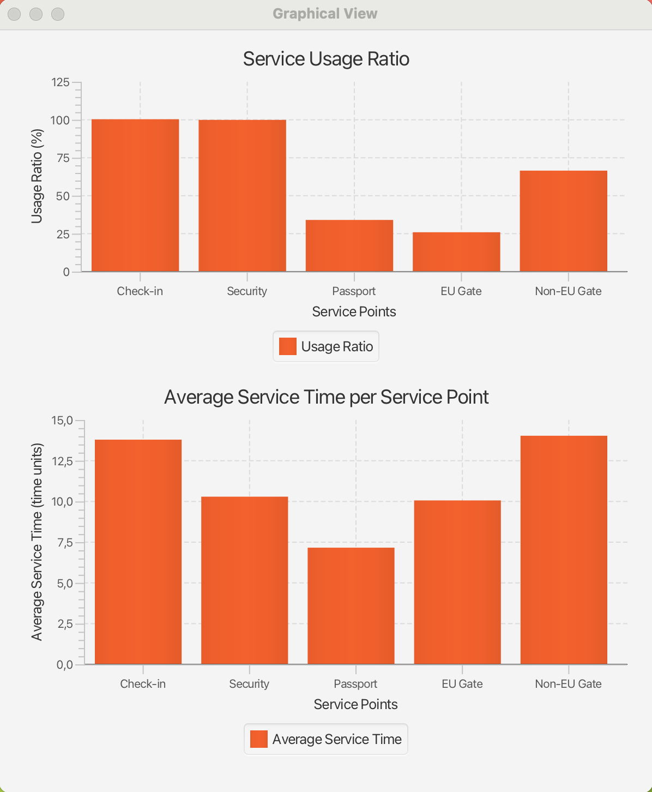

# Airport Simulator 

This project simulates the process of passengers going through an airport. The simulation is based on a queueing model, 
where passengers arrive at the airport and go through various service points such as check-in, security, passport, and 
boarding. The simulation allows users to configure various parameters such as arrival time between passengers, number 
of passengers traveling out of the EU, simulation time, and delay.

## How to use

In the simulation interface the user has the option to configure the simulation using the parameters given to the user 
including arrival time between passengers, amount of passengers traveling out of the EU, simulation time, and delay 
(doesn't impact results). The middle of the interface displays the current queues on service points, and the right side 
of the interface displays the results of the simulation.

## Technologies Used

- **Java**: The primary programming language used for the simulation.
- **Maven**: A build automation tool used for managing project dependencies and building the project.
- **JavaFX**: A Java library used for building the graphical user interface (GUI) of the simulation.
- **MongoDB**: A NoSQL database used for storing airport configurations data.
- **Mockito**: A mocking framework used for unit testing the simulation code.
- **JUnit5**: A testing framework used for unit testing the simulation code.
- **Javadoc**: A documentation generator used for generating API documentation from the Java source code.

## Project team

- Riku Kaartoaho
- Riku Toivanen
- Monami Kirjavainen
- Victoria Vavulina
